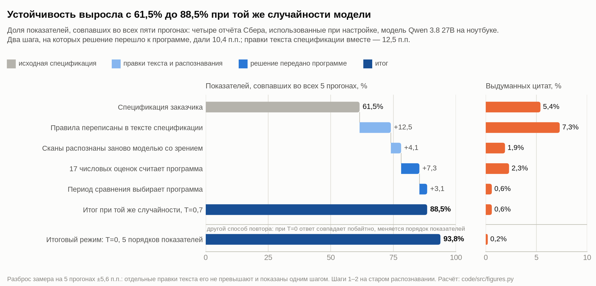
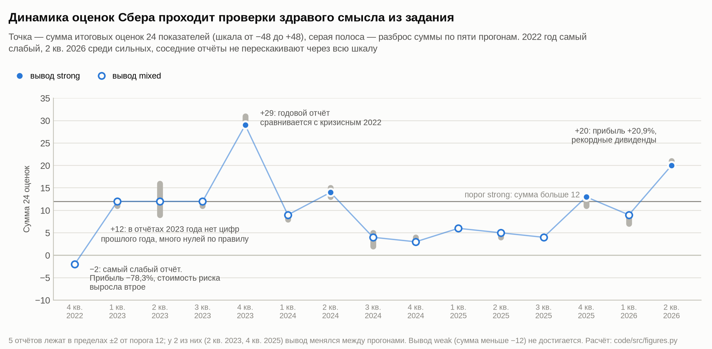
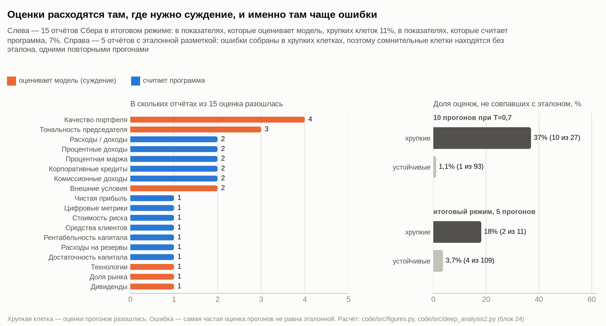

# Устойчивые оценки банковских отчётов с помощью языковой модели

Андрей Гладышев, группа Э312, экономический факультет МГУ

Записка к заданию «Как превратить отчёт банка в цифры, которым можно доверять». Расчёты, сравнение моделей и ответы на
вопросы задания вынесены в [приложения](ПРИЛОЖЕНИЯ.md); все числа воспроизводятся скриптами из папки
[code](code/README.md) по сохранённым ответам моделей.

## Итоги

Оценены 15 пресс-релизов Сбера по МСФО за 2022–2026 годы по 24 показателям, каждый отчёт прогонялся пять раз. Ниже
«клетка» означает оценку одного показателя в одном отчёте, всего клеток 360.

| что измерялось | результат |
|---|---|
| Клетки, одинаковые во всех пяти прогонах | 331 из 360 (91,9%) |
| Отчёты с одинаковым итоговым выводом во всех прогонах | 13 из 15 |
| Разброс суммы оценок между прогонами | не больше 2 пунктов у 13 отчётов из 15 |
| Цитаты | у всех 245 ненулевых оценок; все 322 цитаты совпадают с текстом PDF посимвольно |
| Совпадение с эталонной разметкой | 114 из 120 клеток, на отложенных отчётах 68 из 72; ошибок знака нет |
| Проверки здравого смысла | выполнены: 2022 год самый слабый (−2), 2 кв. 2026 года среди сильных (+20) |

## 1. Как получены оценки

Основная модель — Qwen 3.8 27B, сжатая до 4 бит. Она работает на ноутбуке (MacBook Pro M1 Max, 32 ГБ), так что текст
отчёта не покидает компьютер. Та же схема для сравнения прогнана на 17 облачных моделях (приложение В).

PDF Сбера — сканы, и обычное распознавание (Tesseract) отрывало подписи таблиц от цифр. Скрытый текстовый слой в
файлах есть, но таблицы в нём идут потоком, а числа разбиты пробелами («6 , 7 %»). Поэтому страницы переписала в текст
сама Qwen 27B, умеющая читать изображения, а скрытый слой пригодился для проверки: в распознанном тексте нашлось 97,1%
его чисел, в 478 строках таблиц нет ни одной перестановки столбцов.

Работа разделена между моделью и программой. По 17 числовым показателям модель только выписывает цитату, значение,
базу сравнения и названное изменение, отдельно за квартал и с начала года. Программа выбирает период, считает
изменение и переводит его в оценку по порогам спецификации (3% и 15%, для коэффициентов 0,3 и 1,5 п.п.). Семь
показателей требуют суждения (прогноз, качество портфеля, доля рынка, дивиденды, технологии, внешние условия, тон
председателя), их оценивает модель. Сумму и вывод считает программа; она же проверяет, что каждая цитата есть в
тексте, и ставит в таблицу точный фрагмент PDF.

Прогоны идут при температуре 0. На ноутбуке повтор такого запроса даёт побайтно тот же ответ, поэтому в каждом из пяти
прогонов менялся порядок показателей в запросе: если оценка от него зависит, модель в этом месте не уверена. Итог
клетки — медиана пяти оценок, во всех клетках она совпала с самым частым значением, которое требует задание. Клетки с
разными оценками названы хрупкими и помечены для проверки человеком. Контрольный прогон при температуре 0,7 дал 85,8%
устойчивых клеток.

## 2. Что сработало

*Рисунок 1. Вклад каждого шага в долю устойчивых клеток и доля выдуманных цитат (четыре отчёта, использованные при
настройке).*

При одной и той же температуре 0,7 устойчивость выросла с 61,5% до 88,5%, итоговый режим (температура 0 и пять
перестановок) дал на этих отчётах 93,8% (рисунок 1). Из отдельных изменений больше всего дали те, где решение
переходило от модели к программе: расчёт оценки по числам добавил 7,3 п.п., выбор периода ещё 3,1. Переписанные
правила спецификации вместе дали 12,5 п.п., но это сумма многих правок, и каждая по отдельности не выходит за
разброс замера (±5,6 п.п.). Правки закрывают двоякие места: какой период брать, с чем сравнивать
расходы, как считать долю рынка по сегментам, по каким признакам оценивать тон ([спецификация](СПЕЦИФИКАЦИЯ.md),
раздел 2). Новое распознавание прибавило 4,1 п.п. и снизило долю выдуманных цитат с 7,3% до 1,9%.

Устойчивость не гарантирует правильности, поэтому правильность проверялась по эталонной разметке пяти отчётов. Её
сделала модель Claude Opus 5 по той же спецификации; автор проверил вручную два отчёта целиком и все 11 спорных клеток
и нашёл одну ошибку разметки. Три отчёта были отложены и при настройке не разбирались. Совпадение с эталоном на них
94%, на отчётах для настройки 96%: метод не подогнан под тексты.

*Рисунок 2. Сумма оценок по отчётам Сбера и её разброс между прогонами.*

Суммы оценок согласуются с содержанием отчётов (рисунок 2). Самый слабый — 2022 год: прибыль −78,3%, стоимость риска
выросла втрое. Пик в 4 кв. 2023 года объясняется базой: годовой отчёт сравнивает рекордный 2023 год с кризисным 2022.
В отчётах за первые три квартала 2023 года нет цифр прошлого года, поэтому много нулей и одинаковые суммы +12.

## 3. Где метод ошибается и почему

*Рисунок 3. Слева: в скольких отчётах оценка показателя разошлась между прогонами. Справа: доля ошибок в хрупких и
устойчивых клетках.*

Чаще всего расходятся показатели суждения: качество портфеля (в 4 отчётах из 15), тон председателя (3), внешние
условия (2). Среди них хрупких клеток 11%, среди показателей, которые считает программа, 7%. Правило здесь допускает
два прочтения: считать ли сигналом сохранение уровня («качество остаётся высоким»), за какой период сравнивать,
ставить ли +2 за слово «рекорд» в конце речи председателя.

У числовых показателей разброс возникает при выборе цифры, а расчёт стабилен. Из 25 хрупких числовых клеток на 19
отчётах (вместе с другими банками) в 14 программа не разобрала выписанное число и взяла оценку модели, в 8 модель
брала разные цифры одного периода. Пример — средства клиентов за 4 кв. 2025 года: в четырёх прогонах взяты средства
физических лиц (+20,3%, оценка +2), в одном средства всех клиентов (+13,1%, оценка +1). Спецификации отвечает вторая
цифра, с ней вывод по отчёту был бы mixed, а не strong. Клетка помечена как хрупкая, в таблице к ней есть примечание.
Самый трудный отчёт — 2 кв. 2023 (7 хрупких клеток, сумма от 9 до 16): рост к прошлому году назван словами, без цифр,
и такой случай спецификация не описывает.

Хрупкость указывает на ошибки. Одни и те же клетки хрупки при разных возмущениях: двух температурах, перестановке
показателей, тексте без названия банка (вероятность случайного совпадения не выше 1,5%, приложение Б). При температуре
0,7 среди хрупких клеток ошибок 37%, среди устойчивых 1%, в итоговом режиме 18% и 3,7% (рисунок 3). Значит,
сомнительные места находятся без эталона, повторными прогонами. Но четыре из шести расхождений с эталоном модель
повторяет во всех прогонах, и три из них делает большинство сильных моделей. Это спорные места спецификации: считать
ли прогнозом отчёт о выполнении прошлых целей, как оценивать выплату дивидендов без сравнения. Их находит только
сверка с эталоном.

Модели запрещено считать, но в 6,5% числовых полей она выписывала базу, которой в отчёте нет: в отчёте за 2022 год
назван только рост корпоративного портфеля на 13,2%, а модель писала базу «16,7 трлн руб.», в другом прогоне «16,5
трлн руб.». Программа в таких случаях берёт изменение из отчёта, так что на выдуманные числа не опирается ни одна
оценка. Сверка с PDF нашла и семь цитат, где распознавание исказило слово («кольцо Ber» вместо «кольцо Sber»); в
таблице стоит текст PDF.

Вывод менялся в двух отчётах, и у обоих сумма отстоит от порога strong (больше 12) не больше чем на два пункта; всего
таких пограничных отчётов пять. Вывод weak почти недостижим: в среднем 7,7 оценки из 24 равны нулю, и даже кризисный
2022 год дал −2.

## 4. Что не сработало

- Отдельные правки формулировок (версии 3, 4, 6, 9, спецификация без примеров): эффект в пределах разброса, «улучшения»
  на трёх прогонах исчезали на пяти.
- Требование заполнять обе ячейки периода (версия 8): устойчивость выросла, но выдуманных цитат стало в пять раз
  больше, а чисел не из отчёта 11,5% вместо 6,5%. По одной устойчивости эта версия была бы принята.
- Два шага «свободный текст, затем таблица»: перевод точен (149 оценок из 149), но свободный текст менее устойчив.
- Порядок «сначала оценка, потом обоснование»: модель зацикливалась, ответ обрывался.
- Максимальное размышление: DeepSeek в трёх запросах из пяти потратил весь лимит в 48 тыс. токенов и не ответил;
  умеренное, наоборот, помогает (приложение Г).
- Небольшие «смеси экспертов» (3–12 млрд работающих параметров): в 3–8 раз больше хрупких клеток, до 43% выдуманных
  цитат.
- Повторяемость в облаке: ни одна модель не дала пяти одинаковых ответов на один запрос.
- Закрытые списки фраз и абсолютные пороги стоимости риска не переносятся на другие банки: у Т-Банка стоимость риска
  5–7%, и обычное колебание на 0,6 п.п. даёт −2.
- Версия 10 с правилами из ручной проверки эталона устойчивее (338 клеток против 331), но на отложенных отчётах
  совпала с эталоном в 66 клетках из 72 против 68 и по заранее записанному правилу не принята.

## 5. Выводы и предложения

Устойчивость определяется прежде всего устройством процесса: модель читает отчёт и выписывает факты, программа считает
оценки, повторные прогоны с перестановками показывают, где модель не уверена, и эти клетки проверяет человек.

1. Отдавать человеку хрупкие клетки (8%) и отчёты около порога (5 из 15). На размеченных отчётах среди остальных
   клеток ошибок 3,7%, все на один балл.
2. Если программа не может посчитать оценку, ставить 0 и отдавать клетку человеку: доля устойчивых клеток растёт до
   94,4%, совпадение с эталоном меняется со 114 до 113 клеток.
3. Уточнить спецификацию: направление без величины даёт ±1, период задаётся типом показателя, средства клиентов —
   это средства всех клиентов, пороги стоимости риска относительные, оценочные слова задаются классами по смыслу
   ([спецификация](СПЕЦИФИКАЦИЯ.md), раздел 5).
4. Сравнивать сумму с историей самого банка в стандартных отклонениях: 2022 год получает −1,6, 4 кв. 2023 года +2,6,
   и вывод weak становится достижимым.
5. Использовать собственный компьютер и плотную модель на 27–31 млрд параметров в 4 битах: результат повторяется
   побайтно. Из облачных лучше всего DeepSeek V4.1 Flash с умеренным размышлением: 1,0 хрупкой клетки на отчёт за
   6 центов (приложения В и Г).

Работа заняла 10 дней: 1 371 прогон на ноутбуке (124 часа), 1 062 облачных запроса к 17 моделям за 14,41 доллара, 21
версия спецификации.

## Состав папки

| что | где |
|---|---|
| Таблица оценок 15 × 24 с обоснованием, цитатой, оценками пяти прогонов и примечаниями проверки | [ТАБЛИЦА_ОЦЕНОК.md](ТАБЛИЦА_ОЦЕНОК.md) |
| Замеры устойчивости по каждому отчёту | [ЗАМЕРЫ_УСТОЙЧИВОСТИ.md](ЗАМЕРЫ_УСТОЙЧИВОСТИ.md); таблица Excel, которую просит задание (лист на отчёт: 24 показателя × 5 прогонов, совпадения и суммы посчитаны формулами) — [ЗАМЕРЫ_УСТОЙЧИВОСТИ.xlsx](ЗАМЕРЫ_УСТОЙЧИВОСТИ.xlsx); в машинном виде — [stability.csv](stability.csv), [runs.csv](runs.csv) |
| Итоговые векторы | [vectors.csv](vectors.csv), [vectors.json](vectors.json) |
| Спецификация с описанием изменений | [СПЕЦИФИКАЦИЯ.md](СПЕЦИФИКАЦИЯ.md) |
| Приложения | [ПРИЛОЖЕНИЯ.md](ПРИЛОЖЕНИЯ.md) |
| Рисунки 1–10 | [figures](figures/) |
| Эталонная разметка и заранее записанная процедура порога отказа | [gold_labels](gold_labels/README.md) |
| Скрипты, ответы моделей, распознанные тексты, выводы расчётов | [code](code/README.md) |
| Оценки отчётов ВТБ и Т-Технологий для проверки переноса | [vectors_other_banks.csv](vectors_other_banks.csv) |
