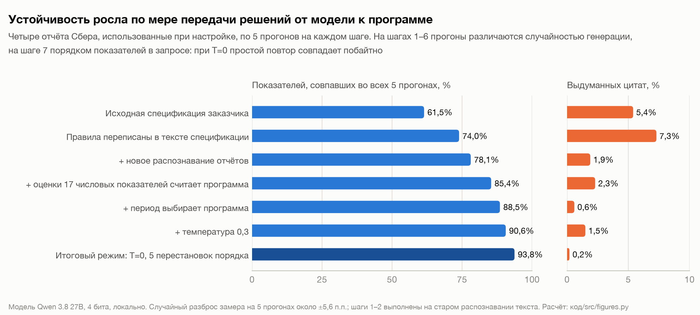
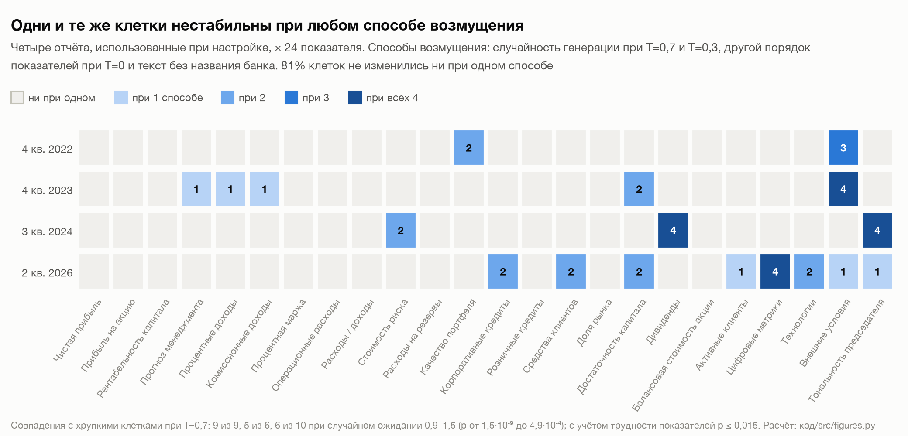
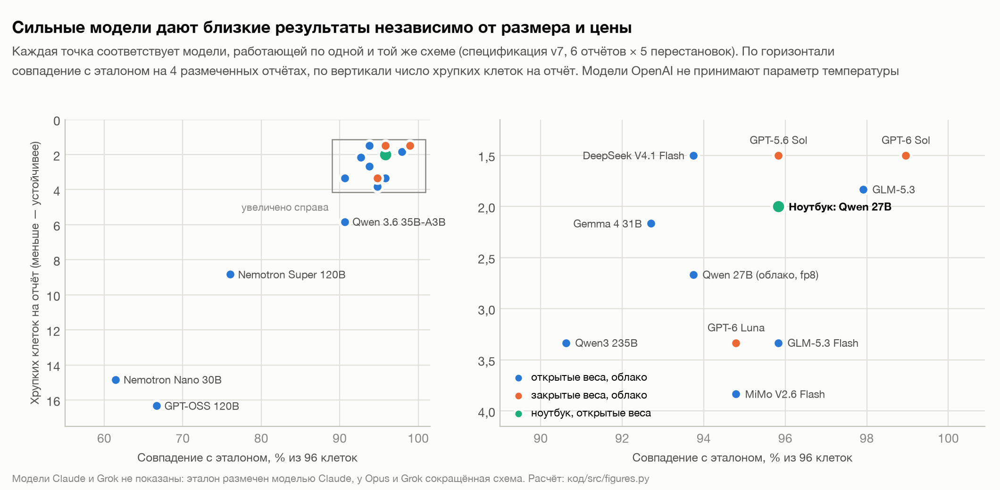

# Устойчивые оценки банковских отчётов с помощью языковой модели

Андрей Гладышев, группа Э312
Экономический факультет МГУ

Записка к заданию «Как превратить отчёт банка в цифры, которым можно доверять». Все расчёты воспроизводятся
скриптами из папки [код](код/README.md) по сохранённым ответам моделей; там же описано, какой скрипт даёт какое
число.

## Основные результаты

Оценены 15 пресс-релизов Сбера по МСФО за 2022–2026 годы по 24 показателям спецификации, каждый по шкале от −2
до +2. Каждый отчёт прогонялся через модель пять раз. Далее «клеткой» называется оценка одного показателя в одном
отчёте; всего клеток 360.

| показатель | результат |
|---|---|
| Клетки, одинаковые во всех пяти прогонах | 331 из 360 (91,9%) |
| Отчёты, у которых итоговый вывод (strong или mixed) одинаков во всех прогонах | 13 из 15 |
| Разброс суммы оценок между прогонами | не больше 2 пунктов у 13 отчётов из 15; наибольший у отчёта за 2 кв. 2023 (от 9 до 16) |
| Ненулевые оценки с дословной цитатой из отчёта | 245 из 245 |
| Цитаты, которых нет в тексте отчёта | 0,2% |
| Совпадение с эталонной разметкой | 114 из 120 клеток (95%); на трёх отложенных отчётах 68 из 72 (94%) |
| Грубые ошибки (неверный знак или расхождение на 2 балла) | ни одной |

При одинаковой степени случайности модели исходная спецификация давала 61,5% совпадающих клеток на четырёх
отчётах, использованных для настройки. Предложенный метод на тех же отчётах даёт 88,5%.

Проверки здравого смысла из задания выполняются. Отчёт за 2022 год оказался самым слабым (сумма оценок −2),
отчёт за 2 кв. 2026 сильным (+20), и соседние кварталы не перескакивают через всю шкалу.

Эталон для проверки правильности размечен моделью Claude Opus 5 по той же спецификации и вручную проверен
автором: два отчёта целиком, а в трёх отложенных отчётах все 11 клеток, которые разметчик сам пометил как спорные.
Найдена одна ошибка разметки. Эталон приложен в папке [эталон](эталон/).

## 1. Как получены оценки

### Модель

Основная модель, Qwen 3.8 27B, сжата до 4 бит, чтобы поместиться в память ноутбука. Она работает на MacBook Pro
(M1 Max, 32 ГБ) в программе LM Studio, поэтому текст отчёта не уходит во внешние сервисы. Для банка это условие,
скорее всего, было бы обязательным. Для сравнения та же схема прогнана на 17 облачных моделях. Среди них есть
модели с открытыми весами, которые можно скачать и запустить у себя, и закрытые, доступные только через сервис
разработчика.

### Чтение отчётов

Файлы Сбера собраны из сотен отдельных картинок, и обычное распознавание текста (Tesseract) отрывало подписи таблиц
от цифр. Поэтому отчёты постранично прочитала сама Qwen 27B, которая умеет работать с изображениями, и переписала
таблицы в текстовом виде; на один отчёт уходило около 13 минут. Качество распознавания проверено по скрытому
текстовому слою PDF. В распознанном тексте нашлось 96,6–98,5% его чисел, а в 478 строках таблиц не оказалось ни
одной перестановки столбцов. Одна эта замена подняла долю устойчивых клеток на 4 процентных пункта (п.п.) и снизила
долю выдуманных цитат с 7,3% до 1,9%.

### Схема оценки

Работа разделена между моделью и программой.

1. По каждому из 17 числовых показателей модель выписывает цитату из отчёта, значение, базу сравнения и изменение,
   если оно названо в тексте. Цифры за квартал и с начала года записываются отдельно. Считать модели запрещено.
2. Программа выбирает нужный период по правилу, считает изменение и переводит его в оценку по порогам
   спецификации.
3. Семь показателей требуют суждения: прогноз менеджмента, качество портфеля, доля рынка, дивиденды,
   технологическое развитие, внешние условия и тон председателя. Их оценивает модель.
4. Сумму оценок и итоговый вывод считает программа. Она же проверяет, что каждая цитата действительно есть в
   тексте отчёта, и подставляет в таблицу точный фрагмент текста.

### Повторные прогоны

Каждый отчёт прогонялся пять раз с температурой 0. Температура задаёт степень случайности ответа: при нулевой
модель всегда выбирает самый вероятный вариант. На ноутбуке повторный запрос при этом даёт ответ, совпадающий
побайтно, даже через сутки, так что пять одинаковых запросов ничего бы не проверили. Поэтому в каждом прогоне
менялся порядок, в котором 24 показателя перечислены в запросе. Текст отчёта остаётся тем же, и если оценка
показателя зависит от порядка, значит, в этом месте модель не уверена.

Итоговой оценкой клетки считается медиана пяти оценок. Во всех 360 клетках она совпала с самым частым значением,
которое требует брать задание. Клетки, в которых оценки разошлись, называются хрупкими; их предлагается передавать
на проверку человеку. Контрольный прогон того же метода с температурой 0,7, то есть с заметной случайностью, дал
85,8% совпадающих клеток.

## 2. Что повысило устойчивость

*Рисунок 1. Доля устойчивых клеток и выдуманных цитат на каждом шаге доработки метода (четыре отчёта,
использованных при настройке).*

Больше всего устойчивость росла на тех шагах, где решение переходило от модели к программе: выбор периода, расчёт
изменения, сравнение с порогом. Каждый такой шаг добавлял от 3 до 7 п.п. Все правки формулировок спецификации
вместе дали 12,5 п.п., но по отдельности их эффект не отличается от случайного разброса, который на пяти прогонах
составляет около ±5,6 п.п.

Устойчивость сама по себе ещё не означает правильности: модель может стабильно ошибаться. Поэтому правильность
проверялась отдельно, по эталону. Три отчёта были отложены заранее и не использовались до финального прогона. На
них совпадение с эталоном составило 94%, на отчётах, использованных при настройке, 96%. Значит, метод не подогнан
под конкретные тексты. По устойчивости отложенные отчёты хуже: в среднем 3,3 хрупкой клетки на отчёт против 1,5.
Разницу почти целиком даёт один отчёт за 2 кв. 2023, о котором сказано ниже. У восьми других отчётов, не
участвовавших в настройке, в среднем 1,6 хрупкой клетки.

## 3. Проблемы метода и их причины

### Показатели, требующие суждения

Чаще всего оценки расходились у качества портфеля (в 4 отчётах из 15), тона председателя (в 3) и внешних условий
(в 2). У восьми сильных моделей картина та же: показатели, которые оценивает модель, оказывались хрупкими в 15%
случаев, числовые показатели, которые считает программа, в 6%. Причина в том, что правило допускает два прочтения.
Неясно, считать ли сигналом сохранение уровня («качество портфеля остаётся высоким»), за какой период сравнивать,
нужно ли слово «рекорд» буквально и учитывать ли всю речь председателя или только её начало.

### Числовые показатели

Здесь разброс возникает при выборе цифры, а сам расчёт стабилен, потому что его делает программа. На 19 отчётах
(15 отчётов Сбера и 4 отчёта других банков) нашлось 25 хрупких числовых клеток:

- в 14 случаях программа не смогла разобрать выписанное число и взяла оценку модели;
- в 8 модель в разных прогонах брала разные цифры одного периода, например базу прошлого квартала вместо прошлого
  года или данные по одному сегменту вместо всего портфеля;
- в 2 расходились названное в отчёте изменение и посчитанное;
- в 1 модель брала разный период.

### Отчёт за 2 кв. 2023

Это самый трудный отчёт набора: 7 хрупких клеток, сумма оценок в разных прогонах от 9 до 16, итоговый вывод
менялся. Рост к прошлому году в нём описан словами («выросла по отношению к аналогичному периоду прошлого года»), а
цифр 2022 года нет. Спецификация такой случай не описывает, поэтому в одних прогонах модель ставит ±1, а в других 0.

### Хрупкость связана прежде всего с конкретной клеткой

Хрупкость проверена четырьмя способами: две температуры (0,7 и 0,3), перестановка показателей и текст отчёта без
названия банка. Нестабильными каждый раз оказывались одни и те же клетки (рисунок 2). Все 9 клеток, хрупких при
температуре 0,3, были хрупкими и при 0,7. Для перестановок совпали 5 клеток из 6, для обезличенного текста 6 из 10,
тогда как случайное совпадение дало бы 1–1,5 клетки. Связь сохраняется и с поправкой на то, что некоторые
показатели трудны сами по себе: вероятность получить такое совпадение случайно не превышает 1,5% (p ≤ 0,015). 81%
клеток не изменились ни разу. Кроме того, там, где между собой расходятся четыре сильные модели, основная модель
тоже неустойчива: так в 11 клетках из 14. Отсюда практический вывод: сомнительные клетки можно найти без эталона,
одними повторными прогонами.

*Рисунок 2. Сколькими из четырёх способов возмущения каждая клетка оказалась хрупкой (четыре отчёта,
использованных при настройке).*

### Ошибки, которые повторные прогоны не находят

Из шести расхождений с эталоном только два пришлись на хрупкие клетки. Остальные четыре модель делает одинаково во
всех прогонах, и три из них повторяют пять из восьми сильных моделей. Это спорные места спецификации: считать ли
прогнозом отчёт о выполнении прошлых целей, как оценивать выплату дивидендов без сравнения с прошлым годом,
учитывать ли слово «рекорд» в конце речи председателя. Такие ошибки находятся только сверкой с эталоном и ручным
разбором.

### Итоговый вывод около порога

Отчёт считается сильным, если сумма оценок больше 12. Пять отчётов из пятнадцати лежат в пределах двух пунктов от
этого порога, и вывод менялся только у них. Вывод «weak» при этом правиле практически недостижим: в среднем 7,7
оценки из 24 равны нулю, и даже кризисный 2022 год дал сумму −2.

### Окружение

Часть нестабильности вносит окружение модели. Кэш запросов в LM Studio при температуре 0 однажды изменил знак
оценки, поэтому перед каждым прогоном модель загружается заново. В LM Studio нашлась и скрытая настройка по
умолчанию (min_p), которая влияла на ответы. В облаке одинаковый запрос дал разный текст у всех 17 моделей, потому
что сервер объединяет запросы разных пользователей в пакеты. Кроме того, в коде обработки найдены и исправлены
четыре ошибки, одна из них в проверке цитат. Все числа в записке получены после исправлений.

## 4. Что не сработало

- **Отдельные правки формулировок** (версии спецификации 3, 4, 6 и 9, спецификация с примерами и без них) давали
  изменения в пределах случайного разброса. По трём прогонам этот разброс около ±7 п.п., и несколько «улучшений»
  исчезли при проверке на пяти.
- **Требование заполнять обе ячейки периода** (версия 8) повысило устойчивость, но выдуманных цитат стало в пять
  раз больше: пустую ячейку модель заполняла несуществующей цифрой. При оценке только по устойчивости эта версия
  была бы принята.
- **Двухшаговая схема «сначала свободный текст, потом перевод в таблицу»** перевела текст точно (149 оценок из
  149), но сам свободный текст оказался менее устойчивым: доля совпадений 0,760 против 0,823.
- **Порядок «сначала оценка, потом обоснование»** приводил к тому, что модель зацикливалась и ответ обрывался.
- **Максимальный уровень размышления.** DeepSeek в трёх запросах из пяти израсходовал весь лимит в 48 тыс. токенов
  на рассуждение и не выдал ответа.
- **Небольшие модели и модели типа «смесь экспертов»**, у которых при обработке каждого слова работает только
  3–12 млрд параметров. У них в 3–8 раз больше хрупких клеток и до 43% выдуманных цитат.
- **Воспроизводимость в облаке.** Даже при температуре 0 и фиксированном начальном значении генератора случайных
  чисел (seed) ответ не повторился ни у одной модели.
- **Закрытые списки оценочных фраз и абсолютные пороги стоимости риска.** На Сбере они работают, но на другие банки
  не переносятся. У Т-Банка стоимость риска составляет 5–7%, и обычное колебание на 0,6 п.п. даёт оценку −2.
- **Правила, выработанные при ручной проверке эталона** (версия 10). Эта версия устойчивее и точнее на бесспорных
  клетках, но на отложенных отчётах совпала с эталоном в 66 клетках из 72 против 68 у основной версии. По правилу
  выбора, записанному до финального прогона, она не принята.

## 5. Сравнение моделей и требования к оборудованию

*Рисунок 3. Правильность и устойчивость 15 моделей на одной и той же схеме: 6 отчётов, по 5 перестановок.*

### Сильные модели дают близкие результаты

Основная модель на ноутбуке, DeepSeek V4.1 Flash и GLM-5.3 на 19 отчётах совпадают в 90–93% клеток. Итоговый вывод
одинаков у всех трёх в 16 отчётах из 19, и все три расхождения приходятся на отчёты с суммой около порога (от 9 до
14). По правильности модели не различаются: 111–114 клеток из 120. DeepSeek устойчивее основной модели: 1,3
хрупкой клетки на отчёт против 2,3. Разница составляет 0,95 клетки, и с вероятностью 90% она лежит в пределах от
0,16 до 1,79.

### Открытые модели не уступают закрытым

У лучших закрытых моделей (GPT-6 Sol и GPT-5.6 Sol) 1,5 хрупкой клетки на отчёт и 92–95 совпадений с эталоном из
96. У лучших открытых 1,5–1,8 и 90–94. Разница лежит в пределах случайного разброса, а стоимость отличается сильно:
оценка одного отчёта через DeepSeek стоит 1,4 цента, через GPT-6 Sol 24 цента.

### Объём памяти не определяет устойчивость

Модели, которым нужно 128–256 ГБ памяти, в исследованном наборе оказались хуже ноутбука. Устойчивее только самые
большие модели, требующие 400 ГБ и больше, и то на 0,5–1 клетку на отчёт. Внутри одного класса оборудования
разница больше, чем между классами. В 32 ГБ помещаются и основная модель (2,0 хрупкой клетки на отчёт), и две
модели типа «смесь экспертов» (5,8 и 14,8).

### Умеренное размышление помогает

В этом режиме модель перед ответом записывает рассуждение. У трёх моделей вместе 11 клеток стали верными и ни одна
не стала неверной; по точному тесту Макнемара вероятность такого результата при отсутствии эффекта составляет 0,1%
(p = 0,001). Хрупких клеток стало на 0,6 меньше на отчёт. Запрос при этом дороже в 1,6–4,1 раза.

### Воспроизводимость обеспечивает собственное оборудование

В облаке повтор одинакового запроса меняет оценки у лучших моделей в 0–3 клетках из 24, у слабых в 12–13. На
ноутбуке ответ совпадает побайтно. Платить за это приходится временем: около 30 минут и 40 Вт·ч на один отчёт.

## 6. Ответы на вопросы задания

### Как отличить «модель прочитала» от «модель придумала»?

Цитату проверяет программа: фрагмент должен найтись в тексте отчёта, и все его числа должны стоять рядом. Кроме
того, числовые оценки ставит программа по числам, которые выписала модель. Поэтому случай «цитата настоящая, вывод
неверный» становится заметен: неправильная база или период дают другую оценку. Последний уровень проверки даёт
эталон. Ни одна из шести ошибок метода не связана с выдумкой, все они возникли из-за другого прочтения правила при
верных фактах.

### Помогает ли разбить работу на два шага?

Помогает, если второй шаг выполняет программа: схема «модель выписывает числа, программа считает» подняла
устойчивость примерно на 10 п.п. Схема «модель пишет текст, модель переводит его в таблицу» оказалась хуже на 6 п.п.
(сравнение по трём прогонам). Риск незаметной потери данных реален, и его нужно измерять: на размеченных отчётах
модель поставила ноль вместо ненулевой оценки в 2 случаях из 84 (2,4%). Полнота распознавания проверена по
скрытому текстовому слою PDF.

### Что делать с показателем, который не стабилизируется?

Ни один показатель не исключён. Качество портфеля нестабильно, но это одна из главных характеристик банковского
риска, и без него вектор теряет смысл. Итоговая оценка берётся как медиана пяти прогонов, а при расхождении решение
принимает человек. Таких клеток 29 из 360 (8%). Исключение показателя повышает устойчивость ценой потери
информации, так же как версия 8 повышала её ценой выдуманных цифр.

### Как проверить качество без эталона?

Есть пять проверок, которым эталон не нужен:

1. каждая цитата найдена в тексте дословно;
2. распознавание сверено со скрытым текстом PDF;
3. независимые сильные модели согласуются между собой (90–93% клеток);
4. выполняются соотношения здравого смысла из задания;
5. клетки, нестабильные при разных способах возмущения, чаще содержат ошибки: при температуре 0,7 среди устойчивых
   клеток ошибок 1%, среди хрупких 37%.

Однако ошибку, которую все модели делают одинаково, можно найти только по эталону, поэтому хотя бы небольшая
ручная разметка всё равно нужна.

### Где граница между жёстким правилом и суждением модели?

Всё, что вычисляется из чисел в тексте, должна считать программа. Таких показателей 17 из 24, и именно их перенос в
программу дал основной прирост. За моделью остаются показатели, где нужно понять смысл: тон, внешние условия,
качество портфеля, прогноз. Но и для них правило можно сделать жёстче: описывать признаки вместо степеней
(например, «слово „рекорд“ или цель с цифрой дают +2») и задавать классы по смыслу вместо списков конкретных слов.
Правило полезно проверять переносом на другой банк. Если оно работает на Сбере и перестаёт работать на Т-Банке,
значит, оно подогнано под Сбер.

## 7. Выводы и предложения

Главный вывод работы состоит в том, что устойчивость зависит прежде всего от устройства процесса. Модель читает
отчёт и извлекает факты, программа считает оценки, повторные прогоны с перестановками показывают, где модель не
уверена, и эти клетки проверяет человек.

Предложения:

1. Передавать человеку хрупкие клетки и отчёты с суммой около порога. Это 8% клеток и 5 отчётов из 15. На
   размеченных отчётах среди клеток, принятых автоматически, ошибок 3,7%, и все они на один балл.
2. Если программа не может посчитать оценку, ставить 0 и отправлять клетку человеку вместо того, чтобы брать
   оценку модели. На тех же ответах это поднимает долю устойчивых клеток с 91,9% до 94,4%, а совпадение с эталоном
   меняется со 114 до 113 клеток из 120.
3. Для поиска хрупких клеток делать 10 перестановок вместо 5. На четырёх отчётах, использованных при настройке,
   десять перестановок нашли 10 хрупких клеток вместо 6, а итоговые оценки при этом не изменились.
4. Уточнить спецификацию: при названном направлении без величины ставить ±1; задавать период по типу показателя;
   просить модель указывать период базы сравнения; поручить программе расчёт по тождествам (например, операционный
   доход равен расходам, делённым на отношение расходов к доходам); вместо списков фраз задавать классы по смыслу;
   перейти к относительным порогам стоимости риска (изменение на 20% и 50% от прошлого уровня). Полный список с
   примерами приведён в [спецификации](СПЕЦИФИКАЦИЯ.md), раздел 5.
5. Сравнивать сумму оценок с историей самого банка, то есть смотреть, на сколько стандартных отклонений она
   отличается от средней по прошлым отчётам. Тогда 2022 год получает −1,6, а 4 кв. 2023 года +2,6: выделяются и
   кризис, и рекордный год, а вывод «weak» становится достижимым.
6. Считать частью метода окружение: собственный компьютер, фиксированную версию модели, перезагрузку перед каждой
   серией. В облаке нужен закреплённый провайдер и контрольный повторный запрос.
7. На собственном оборудовании использовать плотную модель на 27–31 млрд параметров, сжатую до 4 бит. Если облако
   допустимо, по результатам сравнения лучше всего подходит DeepSeek V4.1 Flash с умеренным размышлением: 1,0
   хрупкой клетки на отчёт при стоимости около 6 центов за отчёт (без размышления 1,4 цента).

Что стоит проверить дальше:

- версию 10 после того, как спорные клетки эталона независимо оценит второй человек: если его решения совпадут с
  логикой этой версии, она окажется лучше основной по всем критериям;
- объединение трёх сильных моделей: оно должно уменьшить число хрупких клеток, но не систематические ошибки,
  потому что их повторяет большинство моделей;
- относительные пороги стоимости риска на банках другого масштаба (пока они проверены только на четырёх отчётах ВТБ
  и Т-Технологий);
- опережает ли полученный индекс рыночные котировки.

## 8. Затраты

Работа заняла 10 дней. На ноутбуке выполнен 1 371 прогон (124 часа работы, около 11 кВт·ч). В облаке 1 062
запроса к 17 моделям обошлись в 14,41 доллара. Всего проверена 21 версия спецификации.

## Состав папки

| что | где |
|---|---|
| Таблица оценок: 15 отчётов × 24 показателя; для каждой оценки обоснование, дословная цитата, кто её поставил (программа или модель) и оценки во всех пяти прогонах | [ТАБЛИЦА_ОЦЕНОК.md](ТАБЛИЦА_ОЦЕНОК.md) |
| Итоговые векторы оценок; в JSON также все цитаты и оценки по прогонам | [vectors.csv](vectors.csv), [vectors.json](vectors.json) |
| Замеры устойчивости по каждому отчёту | [ЗАМЕРЫ_УСТОЙЧИВОСТИ.md](ЗАМЕРЫ_УСТОЙЧИВОСТИ.md), [stability.csv](stability.csv) |
| Оценки всех пяти прогонов по каждой клетке | [прогоны.csv](прогоны.csv) |
| Спецификация с описанием изменений и их обоснованием | [СПЕЦИФИКАЦИЯ.md](СПЕЦИФИКАЦИЯ.md) |
| Сравнение моделей, оборудование, статистические проверки, порог отказа, оговорки, литература | [ПРИЛОЖЕНИЯ.md](ПРИЛОЖЕНИЯ.md) |
| Рисунки 1–9 | [figures](figures/) |
| Эталонная разметка пяти отчётов, контрольные суммы и заранее записанная процедура порога отказа | [эталон](эталон/) |
| Скрипты, все версии спецификации, ответы моделей, распознанные тексты отчётов, выводы всех расчётов | [код](код/README.md) |
| Оценки четырёх отчётов ВТБ и Т-Технологий, на которых проверялся перенос метода (в основную сдачу не входят) | [vectors_other_banks.csv](vectors_other_banks.csv) |
