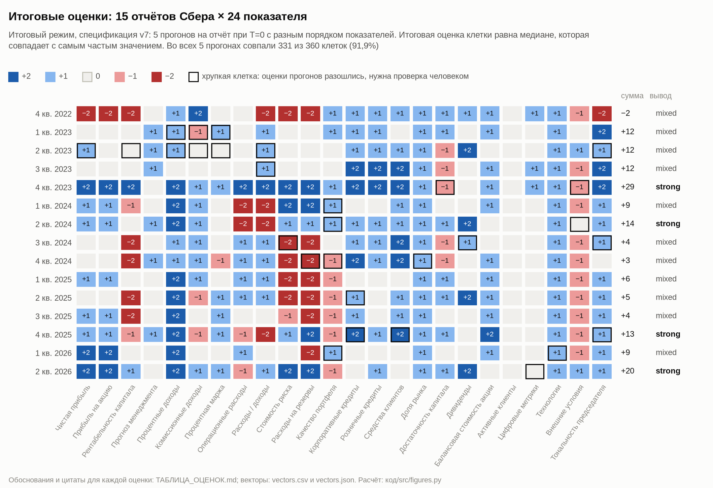
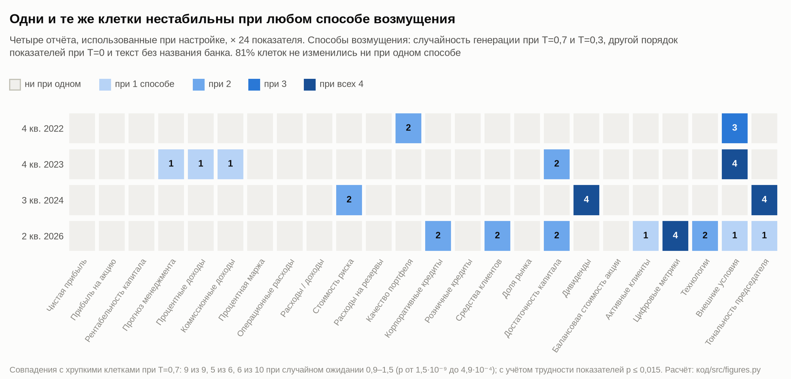
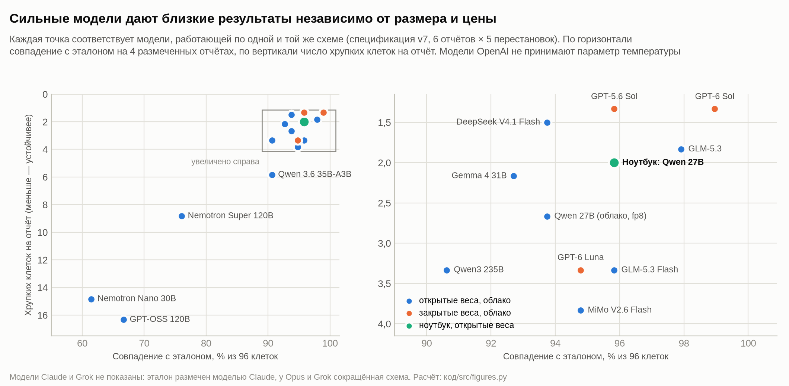
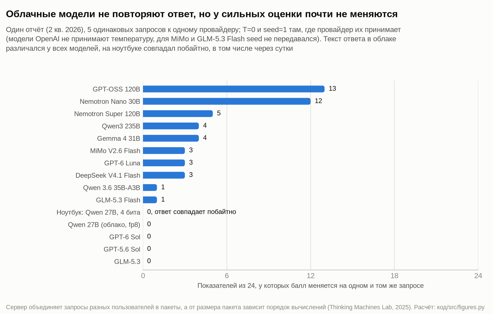
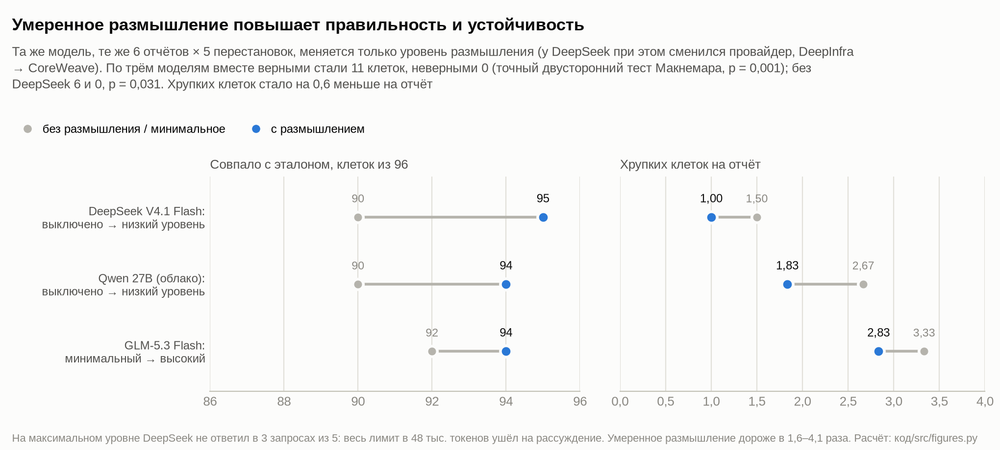
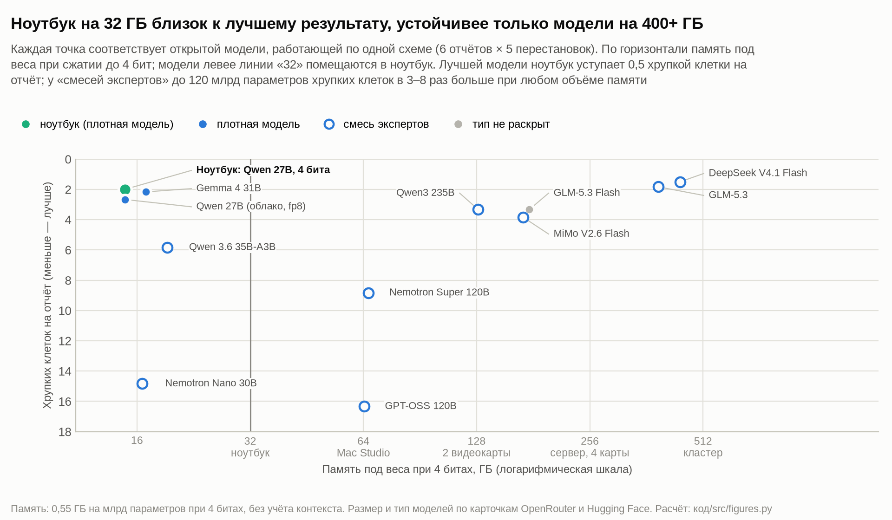
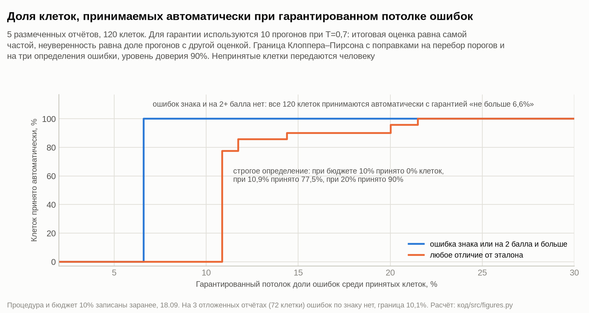

# Приложения к записке

Здесь собраны подробности, на которые опирается [записка](ЗАПИСКА.md). «Клеткой» называется оценка одного
показателя в одном отчёте, хрупкой называется клетка, в которой оценки пяти прогонов разошлись. В конце каждого
раздела указан скрипт, который даёт приведённые числа; сохранённые выводы скриптов лежат в папке
[код/выводы](код/выводы/), порядок запуска описан в [код/README.md](код/README.md). Рисунки 1–3 находятся в записке,
рисунки 4–10 здесь.

- А. Итоговая таблица и динамика оценок Сбера
- Б. Статистические проверки хрупкости
- В. Сравнение моделей
- Г. Повторяемость в облаке и размышление модели
- Д. Требования к оборудованию
- Е. Порог отказа с гарантией на долю ошибок
- Ж. Ответы на вопросы задания
- З. Оговорки к методу
- И. Проверенные гипотезы
- К. Литература

## А. Итоговая таблица и динамика оценок Сбера

*Рисунок 4. Итоговые оценки 15 отчётов Сбера по 24 показателям. Рамкой отмечены хрупкие клетки.*

Сумма оценок по отчётам и её разброс между прогонами показаны на рисунке 2 записки. Оценка показывает, стало ли
лучше или хуже, чем год назад. Поэтому сумма оценок описывает направление изменений,
а уровень показателей банка она не отражает.

В отчётах за первые три квартала 2023 года по многим показателям нет цифр прошлого года. Спецификация в этом случае
требует ставить ноль, поэтому в этих отчётах 11–12 нулей из 24 и одинаковая сумма +12. Годовой отчёт за 2023 год
сравнивается с кризисным 2022 годом, и почти все показатели прибыли, эффективности и риска получают +2. Сумма +29
отражает эффект низкой базы.

В 2024–2025 годах суммы находятся в диапазоне от +3 до +14. Вниз их тянет блок риска. Стоимость риска получила −2
в четырёх отчётах подряд (с 3 кв. 2024 по 2 кв. 2025) и −1 в 3 кв. 2025. Расходы на резервы получили −2 в пяти
отчётах подряд (с 3 кв. 2024 по 3 кв. 2025) и ещё раз в 1 кв. 2026. Рентабельность капитала получила −2 в четырёх
из пяти отчётов того же периода, внешние условия почти везде оценены как −1. Процентные доходы при этом растут (+1
и +2). Такая картина соответствует замедлению при высокой ставке.

В 4 кв. 2025 и 2 кв. 2026 стоимость риска и резервы снова получают положительные оценки (во 2 кв. 2026 обе +2), в 1
кв. 2026 резервы ещё раз оценены как −2. Сумма растёт до +20.

Правило вывода из спецификации не различает кризис и замедление: и 2022 год (−2), и 2024–2025 годы (от +3 до +6)
получают вывод mixed, а вывод weak недостижим. Для сравнения на тех же оценках посчитаны альтернативные правила:

| правило | вывод по 2022 году | отчётов со strong из 15 | вывод одинаков во всех 5 прогонах |
|---|:-:|:-:|:-:|
| сумма больше 12 (спецификация) | mixed | 4 | 13 из 15 |
| среднее по ненулевым оценкам больше 0,5 | mixed | 9 | 15 из 15 |
| среднее по восьми блокам больше 0,5 | mixed | 2 | 12 из 15 |
| отклонение суммы от средней по истории банка, в стандартных отклонениях | −1,6 | выделяются 4 кв. 2023 (+2,6) и 2 кв. 2026 (+1,4) | |

В итоговой таблице сохранено правило заказчика. Предлагается сравнивать сумму с историей самого банка: так
выделяются и кризисный 2022 год, и выбросы вверх. Порог для такого правила нужно задать заранее, а не подбирать по
результату.

При ручной проверке итоговой таблицы к семи клеткам добавлены примечания (файл
[код/notes/примечания_проверки.json](код/notes/примечания_проверки.json)); оценки они не меняют, потому что итог
клетки по заданию равен самому частому значению прогонов. Главное из них касается средств клиентов: в 5 отчётах из 15
модель взяла средства физических лиц, а не всех клиентов. В четырёх случаях оценка по всем клиентам та же, в отчёте
за 4 кв. 2025 года она была бы +1 вместо +2, сумма 12 и вывод mixed вместо strong. Эта клетка хрупкая: в одном из
пяти прогонов модель взяла правильную цифру. Кроме того, к клеткам пяти размеченных отчётов, где оценка расходится с
эталоном, в таблице указана эталонная оценка.

Расчёт: таблица оценок и векторы: [код/src/build_submission.py](код/src/build_submission.py); суммы и правила
вывода: [код/src/deep_analysis.py](код/src/deep_analysis.py), блок 6, и
[код/src/deep_analysis2.py](код/src/deep_analysis2.py), блок 12; рисунки: [код/src/figures.py](код/src/figures.py).

## Б. Статистические проверки хрупкости

*Рисунок 5. Сколькими из четырёх способов возмущения каждая клетка оказалась хрупкой (четыре отчёта,
использованные при настройке).*

### Одни и те же клетки хрупки при разных возмущениях

На четырёх отчётах, использованных при настройке (96 клеток), модель возмущалась четырьмя способами, и
сравнивалось, совпадают ли хрупкие клетки. Опорным считался способ с температурой 0,7 (10 прогонов, 14 хрупких
клеток).

| способ | хрупких клеток | из них хрупких и при T=0,7 | ожидалось при случайном совпадении | вероятность случайно | ожидалось с учётом трудности показателей | вероятность случайно с учётом трудности |
|---|:-:|:-:|:-:|:-:|:-:|:-:|
| температура 0,3, 9 прогонов | 9 | 9 | 1,3 | 1,5·10⁻⁹ | 3,2 | меньше 0,01% |
| перестановка показателей, T=0, 5 прогонов | 6 | 5 | 0,9 | 1,8·10⁻⁴ | 2,0 | 1,1% |
| текст без названия банка, T=0, 5 прогонов | 10 | 6 | 1,5 | 4,9·10⁻⁴ | 3,0 | 1,5% |

Вторая проверка строже первой. В ней хрупкие клетки случайно перемешивались между отчётами внутри каждого
показателя, так что число хрупких клеток у показателя сохранялось. Если бы хрупкость объяснялась только тем, что
некоторые показатели трудны вообще, совпадений было бы 2–3. Их больше, значит, хрупкость связана с конкретным
показателем в конкретном отчёте. При этом 81% клеток (78 из 96) не изменились ни при одном способе.

### Там, где расходятся сильные модели, неустойчива и основная

На шести отчётах (144 клетки) четыре сильные модели расходятся между собой в 13 клетках. Основная модель в 10 из
них тоже неустойчива: либо при перестановках, либо при температуре 0,7. Случайно ожидалось бы 2,9 совпадения, с
учётом трудности показателей 6,0; вероятность получить 10 совпадений случайно составляет 0,7%.

### Сколько перестановок нужно

| число перестановок | 3 | 5 | 7 | 10 |
|---|:-:|:-:|:-:|:-:|
| найдено хрупких клеток на четырёх отчётах | 5 | 6 | 6 | 10 |

При десяти перестановках итоговая оценка не изменилась ни в одной клетке по сравнению с пятью. Пять перестановок
недооценивают число хрупких клеток, но на ответ не влияют.

### Независимость клеток

Ошибки против эталона по пяти размеченным отчётам распределены так: 1, 1, 2, 2 и 0 из 24. Ошибки в клетках одного
отчёта между собой не связаны (внутриклассовая корреляция равна нулю), поэтому клетки можно считать независимыми
наблюдениями, и интервалы, посчитанные по клеткам, не завышают точность.

### Хрупкость и ошибки

Эти данные показаны на рисунке 3 записки.

| режим | хрупких клеток из 120 | ошибок среди устойчивых клеток | ошибок среди хрупких клеток |
|---|:-:|:-:|:-:|
| 10 прогонов при температуре 0,7 | 27 | 1 из 93 (1,1%) | 10 из 27 (37%) |
| итоговый режим: 5 перестановок при температуре 0 | 11 | 4 из 109 (3,7%; верхняя граница 7,2%) | 2 из 11 (18%) |

В итоговом режиме хрупкость ловит только треть ошибок, остальные ошибки систематические. Три из четырёх
систематических ошибок повторяет большинство сильных моделей (5 из 8). Это спорные места спецификации: считать ли
прогнозом отчёт о выполнении прошлых целей, как оценивать выплату дивидендов без сравнения, учитывать ли слово
«рекорд» в конце речи председателя. Объединение нескольких моделей такие ошибки не исправит, потому что их делают
все модели одинаково (Egami, Shin 2026). Исправить их можно только уточнением спецификации.

### Отчёты для настройки и отложенные отчёты

| набор | совпало с эталоном | хрупких клеток на отчёт |
|---|:-:|:-:|
| 2 размеченных отчёта из использованных при настройке | 46 из 48 (95,8%) | 0,5 |
| 3 отложенных отчёта | 68 из 72 (94,4%) | 3,3 |
| все 4 отчёта, использованные при настройке | | 1,5 |
| 8 других отчётов, не участвовавших в настройке | | 1,6 |

По правильности разницы нет. По устойчивости отложенные отчёты хуже из-за одного отчёта за 2 кв. 2023, в котором 7
хрупких клеток: рост к прошлому году в нём назван словами, без цифр.

### Причины хрупкости числовых показателей

На 19 отчётах нашлось 25 хрупких числовых клеток. В 14 случаях программа не смогла разобрать выписанное моделью
число и взяла оценку модели. В 8 модель брала разные цифры одного периода. В 2 расходились названное и посчитанное
изменение, в 1 модель брала разный период. Если в первом случае ставить 0 и отдавать клетку человеку, доля
устойчивых клеток по Сберу вырастет с 91,9% до 94,4%, а совпадение с эталоном изменится со 114 до 113 клеток из
120.

### Какие показатели трудны для всех сильных моделей

| показатель | доля хрупких случаев (8 моделей × 6 отчётов) | кто ставит оценку |
|---|:-:|---|
| качество портфеля | 33% | модель |
| тон председателя | 23% | модель |
| внешние условия | 23% | модель |
| активные клиенты | 17% | программа |
| дивиденды | 12,5% | модель |
| операционные расходы | 12,5% | программа |
| в среднем по показателям, которые оценивает модель | 14,9% | |
| в среднем по показателям, которые считает программа | 5,8% | |

Расчёт: [код/src/final_checks.py](код/src/final_checks.py), блоки B, C, F и G;
[код/src/deep_analysis.py](код/src/deep_analysis.py), блоки 2, 3, 5 и 8;
[код/src/deep_analysis2.py](код/src/deep_analysis2.py), блоки 10, 11, 17 и 24.

## В. Сравнение моделей

*Рисунок 6. Правильность и устойчивость 15 моделей на одной и той же схеме: 6 отчётов, по 5 перестановок.*

Все модели работали по одной и той же схеме и спецификации на шести отчётах: четырёх отчётах Сбера и по одному
отчёту ВТБ и Т-Технологий. Каждый отчёт прогонялся пять раз с разным порядком показателей. Правильность
оценивалась по четырём размеченным отчётам, то есть по 96 клеткам. В квадратных скобках указан интервал, в котором
истинное значение лежит с вероятностью 90%. Для хрупкости он получен бутстрепом (многократной случайной
перевыборкой отчётов), для совпадения с эталоном по точной формуле Клоппера–Пирсона для долей.

| модель | веса | память при 4 битах | параметров, млрд (всего / работающих на каждое слово) | хрупких клеток на отчёт [90%] | совпало с эталоном из 96 [90%] | грубых ошибок | повтор одного запроса: клеток с разной оценкой из 24 | выдуманных цитат | секунд на запрос | долларов за запрос |
|---|---|---|---|---|---|:-:|:-:|:-:|:-:|:-:|
| GPT-6 Sol | закрытые | нет данных | нет данных | 1,33 [0,7; 2,0] | 95 [95%; 100%] | 0 | 0 | 0,3% | 24 | 0,049 |
| GPT-5.6 Sol | закрытые | нет данных | нет данных | 1,33 [0,8; 1,8] | 92 [91%; 99%] | 0 | 0 | 0,5% | 22 | 0,048 |
| DeepSeek V4.1 Flash | открытые | 512 ГБ | 763 / 8–16 | 1,50 [1,2; 1,8] | 90 [88%; 97%] | 0 | 3 | 0,2% | 44 | 0,003 |
| GLM-5.3 | открытые | 512 ГБ | 753 / не раскрыто | 1,83 [1,3; 2,3] | 94 [94%; 100%] | 0 | 0 | 0,3% | 23 | 0,020 |
| Qwen 3.8 27B, 4 бита, ноутбук (основная модель) | открытые | 32 ГБ | 27, все | 2,00 [0,8; 3,2] | 92 [91%; 99%] | 0 | 0 (побайтно) | 0,6% | 352 | 0 |
| Gemma 4 31B (сжатие fp4) | открытые | 32 ГБ | 31, все | 2,17 [1,0; 3,2] | 89 [87%; 97%] | 1 | 4 | 10,2% | 52 | 0,002 |
| Qwen 3.8 27B, облако, fp8 | открытые | 32 ГБ | 27, все | 2,67 [1,0; 5,0] | 90 [88%; 97%] | 0 | 0 | 3,4% | 42 | 0,010 |
| Qwen3 235B | открытые | 256 ГБ | 235 / 22 | 3,33 [2,3; 4,3] | 87 [84%; 95%] | 1 | 4 | 4,0% | 218 | 0,003 |
| GLM-5.3 Flash | открытые | 256 ГБ | 321 / не раскрыто | 3,33 [2,0; 4,8] | 92 [91%; 99%] | 0 | 1 | 2,3% | 36 | 0,004 |
| GPT-6 Luna | закрытые | нет данных | нет данных | 3,33 [2,0; 4,8] | 91 [89%; 98%] | 0 | 3 | 0,9% | 21 | 0,002 |
| MiMo V2.6 Flash | открытые | 256 ГБ | 309 / 15 | 3,83 [2,8; 4,8] | 91 [89%; 98%] | 0 | 3 | 0,2% | 26 | 0,003 |
| Qwen 3.6 35B-A3B | открытые | 32 ГБ | 35 / 3 | 5,83 [4,5; 7,3] | 87 [84%; 95%] | 0 | 1 | 15,5% | 14 | 0,004 |
| Nemotron 3 Super 120B | открытые | 128 ГБ | 120 / 12 | 8,83 [6,0; 11,5] | 73 [68%; 83%] | 0 | 5 | 5,2% | 116 | 0,003 |
| Nemotron 3 Nano 30B | открытые | 32 ГБ | 30 / 3 | 14,83 [10,3; 19,2] | 59 [53%; 70%] | 9 | 12 | 43,3% | 14 | 0,001 |
| GPT-OSS 120B | открытые | 128 ГБ | 117 / 5,1 | 16,33 [12,0; 19,0] | 64 [58%; 75%] | 7 | 13 | 41,1% | 6 | 0,004 |

Пояснения к столбцам. Модели с открытыми весами можно скачать и запустить у себя, закрытые доступны только через
сервис разработчика. «Память при 4 битах» показывает, сколько памяти нужно, чтобы запустить модель, сжатую до 4
бит. У моделей типа «смесь экспертов» при обработке каждого слова работает только часть параметров, это число
указано вторым. Грубой ошибкой считается неверный знак или расхождение с эталоном на 2 балла и больше. «Повтор
одного запроса» показывает, в скольких клетках из 24 менялась оценка, когда один и тот же запрос отправлялся пять
раз.

Модели делятся на три группы. К сильным относятся модели, у которых до 2,7 хрупкой клетки на отчёт и 89–95
совпадений с эталоном из 96: основная модель на ноутбуке, DeepSeek, GLM-5.3, GPT-6 Sol, GPT-5.6 Sol, Gemma и
облачная версия Qwen. У средних моделей 3,3–3,8 хрупкой клетки. Остальные модели для задачи непригодны: у них от
5,8 хрупкой клетки на отчёт, грубые ошибки и до 43% выдуманных цитат.

На шести отчётах разница внутри сильной группы не выходит за пределы случайного разброса. Разность числа хрупких
клеток на отчёт по сравнению с основной моделью составляет у DeepSeek −0,50 [−1,83; +0,83], у GPT-5.6 Sol −0,67
[−1,67; +0,33], у GLM-5.3 −0,17 [−1,00; +0,83]. Все интервалы включают ноль.

Три сильные открытые модели дополнительно прогнаны на всех 19 отчётах (15 Сбера и 4 других банков). На таком
объёме различие уже видно:

| модель | хрупких клеток на отчёт | разность с основной моделью [90%] | совпало с эталоном из 120 [90%] |
|---|:-:|:-:|:-:|
| Qwen 3.8 27B, ноутбук (основная модель) | 2,26 | | 114 [90%; 98%] |
| DeepSeek V4.1 Flash | 1,32 | −0,95 [−1,79; −0,16] | 111 [87%; 96%] |
| GLM-5.3 | 2,16 | −0,11 [−0,79; +0,63] | 114 [90%; 98%] |

Оценки трёх моделей совпадают в 90–93% клеток. Итоговый вывод одинаков у всех трёх в 16 отчётах из 19, а все три
расхождения приходятся на отчёты с суммой около порога (от 9 до 14 при пороге 12).

По устойчивости лучшие закрытые модели (1,33 хрупкой клетки на отчёт) и лучшая открытая (DeepSeek, 1,50)
различаются в пределах случайного разброса. По правильности лучшая закрытая модель (GPT-6
Sol, 95 из 96) опережает лучшую открытую (GLM-5.3, 94) на одну клетку, и интервалы у них перекрываются. При этом
запрос к DeepSeek в 18 раз дешевле, чем к GPT-6 Sol.

В таблице нет моделей Claude и Grok. Эталон размечен моделью Claude, поэтому сравнивать с ним модели того же
разработчика было бы нечестно. Кроме того, Opus 5, Opus 5.5 и Grok 4.7 прогнаны по сокращённой схеме: два отчёта,
по три перестановки. На них хрупких клеток 0,5, 0,5 и 0 на отчёт.

Условия прогонов были одинаковыми с тремя исключениями. Во-первых, модели OpenAI и Opus 5 не принимают параметр
температуры, и у них она задана провайдером по умолчанию. Во-вторых, у GLM-5.3, GLM-5.3 Flash, GPT-OSS, Grok и
Opus 5.5 размышление нельзя отключить, поэтому они работали с минимальным уровнем размышления. В-третьих, у каждой
модели внутри серии был закреплён один провайдер, кроме GPT-OSS (часть ответов пришла от второго провайдера,
Cerebras) и Opus 5 (Azure и AWS).

Расчёт: [код/src/deep_analysis.py](код/src/deep_analysis.py), блок 1; [код/src/final_checks.py](код/src/final_checks.py),
блок D; [код/src/deep_analysis2.py](код/src/deep_analysis2.py), блоки 16 и 19; условия прогонов:
[код/src/audit.py](код/src/audit.py), блок A5. Выводы: [код/выводы/](код/выводы/).

## Г. Повторяемость в облаке и размышление модели

*Рисунок 7. Во скольких клетках из 24 меняется оценка, если один и тот же запрос отправить пять раз.*

Для проверки повторяемости каждой модели пять раз подряд отправлялся один и тот же запрос по одному отчёту через
одного провайдера, с температурой 0 и фиксированным начальным значением генератора там, где провайдер их принимает
(модели OpenAI и Opus 5 температуру не принимают). Ни одна облачная модель не выдала пять одинаковых ответов. У
сильных моделей оценки при этом почти не менялись (0–3 клетки из 24), у слабых менялись в 12–13 клетках. У моделей с
температурой 0 причина в том, что сервер объединяет запросы разных пользователей в пакеты, а от размера пакета
зависит порядок вычислений (Thinking Machines Lab, 2025). Ноутбук при температуре 0 повторяет ответ побайтно, в том
числе через сутки. Поэтому для проверяемости нужно либо собственное оборудование, либо в облаке закреплённый
провайдер и контрольный повторный запрос.

*Рисунок 8. Как меняются правильность и устойчивость, если включить модели размышление.*

В режиме размышления модель перед ответом записывает рассуждение. Три модели сравнивались в двух режимах на одних и
тех же шести отчётах по пять перестановок; менялся только уровень размышления. Значимость проверялась точным тестом
Макнемара: он показывает, насколько вероятно получить такой перевес исправленных клеток над испорченными, если на
самом деле размышление ничего не меняет.

| что сравнивалось | клеток стало верными / неверными | вероятность такого результата случайно | изменение числа хрупких клеток на отчёт [90%] |
|---|:-:|:-:|:-:|
| три модели вместе | 11 / 0 | 0,1% (p = 0,001) | −0,61 [−1,11; −0,11] |
| без DeepSeek (у него в двух режимах были разные провайдеры) | 6 / 0 | 3,1% (p = 0,031) | −0,67 [−1,33; −0,08] |

Умеренное размышление улучшает и правильность, и устойчивость. Размер модели внутри сильной группы, как видно из
раздела В, не даёт ни того, ни другого. Максимальный уровень размышления, наоборот, ломает работу: у DeepSeek три
запроса из пяти закончились на лимите в 48 тыс. токенов без ответа. Запрос с умеренным размышлением дороже в
1,6–4,1 раза.

Расчёт: [код/src/deep_analysis2.py](код/src/deep_analysis2.py), блок 14; [код/src/final_checks.py](код/src/final_checks.py),
блок A; рисунки и отказы при максимальном размышлении: [код/src/figures.py](код/src/figures.py).

## Д. Требования к оборудованию

*Рисунок 9. Хрупкость открытых моделей в зависимости от памяти, которая нужна для их запуска при сжатии до 4 бит.*

Память под веса модели оценивалась как 0,55 ГБ на миллиард параметров при сжатии до 4 бит; модель относилась к
наименьшему классу оборудования, где она помещается с запасом 15% на обработку текста.

| класс оборудования | модели из исследованного набора | лучшая модель класса, хрупких клеток на отчёт |
|---|---|---|
| 32 ГБ, как у ноутбука | Qwen 27B (основная и облачная), Gemma 31B, Qwen 3.6 35B-A3B, Nemotron Nano 30B | основная Qwen 27B, 2,00 (у двух «смесей экспертов» того же класса 5,8 и 14,8) |
| 64 ГБ | в наборе таких моделей нет | |
| 128 ГБ | Nemotron Super 120B, GPT-OSS 120B | 8,83 |
| 256 ГБ | Qwen3 235B, GLM-5.3 Flash, MiMo V2.6 Flash | 3,33 |
| 512 ГБ и больше | DeepSeek V4.1 Flash, GLM-5.3 | 1,50 |

Из этого следуют четыре вывода о выборе оборудования.

1. Плотная модель на 27–31 млрд параметров, сжатая до 4 бит, помещается в ноутбук на 32 ГБ и почти достигает
   лучшего результата. Её обгоняют только модели, которым нужно 400 ГБ и больше, и то на 0,5–1 хрупкую клетку на
   отчёт.
2. Модели классов 128 и 256 ГБ в исследованном наборе хуже ноутбука. Популярные «смеси экспертов», у которых на
   каждое слово работает 3–12 млрд параметров, экономят вычисления, но дают в 3–8 раз больше хрупких клеток.
3. Внутри одного класса архитектура модели важнее объёма памяти. Число работающих параметров тоже не решает всего:
   у DeepSeek их 8–16 млрд, и при этом он самый устойчивый. По-видимому, важны общий объём знаний модели и качество
   её обучения.
4. Сжатие до 4 бит основной модели не повредило: облачная версия тех же весов со сжатием fp8 не устойчивее (2,67
   хрупкой клетки против 2,00, разница в пределах разброса). Для других моделей это не проверялось, так как в
   облаке они работали со сжатием fp8, а Gemma со сжатием fp4.

Затраты на оценку одного отчёта в итоговом режиме (пять прогонов):

| где | на один отчёт | на 15 отчётов |
|---|---|---|
| ноутбук (M1 Max, 32 ГБ) | 30 минут, около 40 Вт·ч, бесплатно | около 7,6 часа |
| DeepSeek V4.1 Flash | 3,7 минуты последовательно (0,7 минуты параллельно), 0,014 доллара | 0,20 доллара |
| GLM-5.3 | 1,9 минуты, 0,099 доллара | 1,48 доллара |
| GPT-6 Sol | 2,0 минуты, 0,243 доллара | 3,65 доллара |
| GPT-6 Luna | 1,8 минуты, 0,012 доллара | 0,18 доллара |

К этому добавляется однократное распознавание сканов, около 13 минут на отчёт на ноутбуке.

Расчёт: [код/src/deep_analysis.py](код/src/deep_analysis.py), блоки 1 и 9; рисунок:
[код/src/figures.py](код/src/figures.py).

## Е. Порог отказа с гарантией на долю ошибок

*Рисунок 10. Какую долю клеток можно принимать автоматически при заданном гарантированном потолке ошибок.*

Идея состоит в том, чтобы принимать оценку автоматически только там, где модель уверена, а остальные оценки
отдавать человеку. Порог уверенности выбирается по размеченным отчётам так, чтобы доля ошибок среди принятых
автоматически оценок с вероятностью 90% не превышала заданного бюджета. Использована схема Learn-then-Test
(Angelopoulos и др.). Все её параметры записаны 18.09, до получения эталонной разметки (об отступлении от записи в части эталона см.
раздел З, пункт 10); запись приложена:
[эталон/ПРЕДРЕГИСТРАЦИЯ_ПОРОГА.md](эталон/ПРЕДРЕГИСТРАЦИЯ_ПОРОГА.md).

Параметры процедуры:

- мерой неуверенности служит доля из 10 прогонов при температуре 0,7, которые дали оценку, отличную от самой частой;
- клетка принимается автоматически, если неуверенность не выше порога; порог выбирается наибольшим, при котором
  верхняя граница доли ошибок среди принятых клеток не превышает бюджета;
- граница считается по формуле Клоппера–Пирсона с уровнем доверия 90% и поправками на перебор порогов и на три
  определения ошибки;
- основное определение ошибки: неверный знак или расхождение с эталоном на 2 балла и больше;
- бюджет ошибок 10%, критерий успеха: автоматически принимается не меньше половины клеток.

Результаты на пяти размеченных отчётах (120 клеток):

| определение ошибки | ошибок без отказа | при бюджете 10% | при бюджете 20% |
|---|:-:|:-:|:-:|
| неверный знак или расхождение на 2+ балла (основное) | 0 из 120 | принимаются все 100% клеток, граница 6,6% | 100% клеток |
| любое расхождение с эталоном (строгое) | 11 из 120 | ни одной клетки | 90% клеток, граница 14,4% |

Заранее записанный критерий успеха выполнен: при бюджете 10% автоматически принимаются все клетки. По строгому
определению процедура начинает принимать клетки с бюджета 10,9% (77,5% клеток). Итоговый вывод strong или mixed,
посчитанный по самым частым оценкам, совпал с эталоном во всех пяти отчётах, но гарантию на пяти отчётах дать
невозможно, поэтому этот результат описательный.

Если оставить только три отложенных отчёта (72 клетки), ошибок по знаку по-прежнему нет, но граница становится
10,1%, то есть на 0,1 п.п. выше бюджета, и заранее записанная процедура не принимает ни одной клетки. Вторичная
процедура (проверка порогов по очереди, от самого строгого) принимает все клетки. По строгому определению
принимается 75% клеток при бюджете 15% и 89% при бюджете 20%.

Две оговорки. Гарантия дана относительно эталона, а сам эталон тоже может ошибаться: при ручной проверке спорных
клеток отложенных отчётов нашлась одна ошибка разметки. Кроме того, гарантия относится к режиму 10 прогонов при
температуре 0,7. В итоговом режиме её аналогом служит передача хрупких клеток человеку: на размеченных отчётах среди
принятых автоматически клеток ошибок 3,7% (верхняя граница 7,2%), и все они на один балл.

Расчёт: [код/src/abstain.py](код/src/abstain.py) (процедура); [код/src/final_checks.py](код/src/final_checks.py),
блок F; [код/src/deep_analysis2.py](код/src/deep_analysis2.py), блоки 13 и 17; рисунок:
[код/src/figures.py](код/src/figures.py).

## Ж. Ответы на вопросы задания

### Как отличить «модель прочитала» от «модель придумала»?

Цитату проверяет программа: фрагмент должен найтись в тексте отчёта, и все его числа должны стоять рядом; в таблицу
ставится фрагмент текстового слоя PDF, совпадающий с отчётом посимвольно. Числовые оценки ставит программа по числам,
которые выписала модель, поэтому случай «цитата настоящая, вывод неверный» становится заметен: неправильная база или
период дают другую оценку. Этого уровня тоже мало: в 6,5% числовых полей модель выписывала базу сравнения, которой в
отчёте нет, пересчитав её из процента. Программа такие базы не использует, если изменение названо в отчёте, и не
показывает их в обосновании. Последний уровень проверки даёт эталон. Ни одна из шести ошибок метода не связана с
выдумкой: все они возникли из-за другого прочтения правила при верных фактах.

### Помогает ли разбить работу на два шага?

Помогает, если второй шаг выполняет программа: схема «модель выписывает числа, программа считает» подняла
устойчивость на 10,4 п.п. Схема «модель пишет текст, модель переводит его в таблицу» оказалась хуже на 6 п.п.
(сравнение по трём прогонам). Риск незаметной потери данных реален, и его нужно измерять: на размеченных отчётах
итоговая оценка оказалась нулём вместо ненулевой в 2 случаях из 84 (2,4%). Полнота распознавания проверена по
скрытому текстовому слою PDF: найдено 97,1% его чисел, в 478 строках таблиц столбцы не переставлены.

### Что делать с показателем, который не стабилизируется?

Ни один показатель не исключён. Качество портфеля нестабильно, но это одна из главных характеристик банковского
риска, и без него вектор теряет смысл. Итоговая оценка берётся как самое частое значение пяти прогонов, а клетки с
расхождением помечаются для проверки человеком; таких клеток 29 из 360 (8%). Исключение показателя повышает
устойчивость ценой потери информации, так же как версия 8 повышала её ценой выдуманных цифр.

### Как проверить качество без эталона?

Есть пять проверок, которым эталон не нужен:

1. каждая цитата найдена в тексте отчёта посимвольно;
2. распознавание сверено со скрытым текстовым слоем PDF;
3. независимые сильные модели согласуются между собой (90–93% клеток);
4. выполняются соотношения здравого смысла из задания;
5. клетки, нестабильные при разных способах возмущения, чаще содержат ошибки: при температуре 0,7 среди устойчивых
   клеток ошибок 1%, среди хрупких 37%.

Однако ошибку, которую все модели делают одинаково, можно найти только по эталону, поэтому хотя бы небольшая ручная
разметка всё равно нужна.

### Где граница между жёстким правилом и суждением модели?

Всё, что вычисляется из чисел в тексте, должна считать программа. Таких показателей 17 из 24, и их перенос в
программу дал основной прирост устойчивости. За моделью остаются показатели, где нужно понять смысл: тон, внешние
условия, качество портфеля, прогноз. Но и для них правило можно сделать жёстче: описывать признаки вместо степеней
(например, «слово „рекорд“ или цель с цифрой дают +2») и задавать классы по смыслу вместо списков конкретных слов.
Правило полезно проверять переносом на другой банк: если оно работает на Сбере и перестаёт работать на Т-Банке, оно
подогнано под Сбер.

Расчёт: [код/src/deep_analysis.py](код/src/deep_analysis.py), блоки 3 и 7;
[код/src/deep_analysis2.py](код/src/deep_analysis2.py), блоки 21, 23 и 24;
[код/src/ocr_order_check.py](код/src/ocr_order_check.py).

## З. Оговорки к методу

1. Эталон размечен моделью Claude Opus 5 и проверен автором вручную: два отчёта целиком и 11 спорных клеток в
   трёх отложенных отчётах. Найдена одна ошибка разметки. Решения автора по спорным местам ближе к логике версии
   10, поэтому правильность основной версии, скорее всего, немного занижена.
2. Модели Claude исключены из сравнения моделей, чтобы эталон не давал им преимущества.
3. У моделей OpenAI и Opus 5 температура не была нулевой, потому что провайдер не принимает этот параметр. У пяти
   моделей размышление не отключается. GPT-OSS в одной серии работал через двух провайдеров. Gemma работала со
   сжатием fp4, остальные облачные модели со сжатием fp8.
4. Отложенные отчёты входили в два проверочных прогона всех 15 отчётов 20.09 (версии спецификации 2 и 7), но их
   оценки при настройке не разбирались. Эталон для них зафиксирован контрольными суммами до финального прогона
   ([эталон/ХОЛДАУТ_ХЕШИ_22.09.txt](эталон/ХОЛДАУТ_ХЕШИ_22.09.txt)); совпадение сумм проверяет
   [код/src/audit.py](код/src/audit.py).
5. Пять перестановок недооценивают хрупкость: при десяти нашлось 10 хрупких клеток вместо 6. Итоговые оценки от
   этого не меняются.
6. Модели сравнивались по хрупкости на шести отчётах. Внутри сильной группы на таком объёме различается только
   DeepSeek, и то лишь при проверке на 19 отчётах.
7. Все числа получены после исправления четырёх ошибок в коде обработки. Одна из них была в проверке цитат:
   служебную разметку распознанного текста программа принимала за выдумку. До исправления доля выдуманных цитат была
   завышена, в итоговом режиме 6,4% вместо 0,2%.
8. Тест Макнемара двусторонний. Интервалы 90%, как в заранее записанной процедуре. Для бутстрепа и перестановочных
   тестов зафиксировано начальное значение генератора случайных чисел, поэтому результаты воспроизводятся.
9. Самая частая оценка по нескольким прогонам одной модели не исправляет систематических ошибок (Egami, Shin 2026).
   Поэтому, кроме повторных прогонов, нужны эталон и ручной разбор.
10. Отступление от предрегистрации. В записи 18.09 ошибка определена как расхождение с ручной разметкой автора.
    Фактически эталоном служит разметка модели Claude Opus 5, которую автор проверил вручную не полностью: два отчёта
    целиком и 11 спорных клеток трёх отложенных отчётов. Гарантии порога отказа (раздел Е) относятся к этому эталону.
11. Хрупкие клетки в сданной таблице человеком не пересматривались: итоговая оценка в них, как требует задание, равна
    самому частому значению прогонов. К семи клеткам добавлены примечания ручной проверки (раздел А), оценки не
    менялись.
12. Проверка 29.09. Цитаты таблицы переписаны по текстовому слою PDF (исправлены семь слов, искажённых
    распознаванием, и номера сносок); если оценку посчитала программа, в цитату поставлена строка с базой сравнения
    или названным изменением; из обоснований убраны базы, которых нет в тексте отчёта. В программе исправлены три
    скрытые ошибки разбора чисел: сравнение с порогом без округления (14,6% − 14,3% давало 0,2999… и оценку 0 вместо
    +1), «Н20.0» читалось как число 20,0, слово «ниже» рядом с уровнем меняло его знак. Итоговые оценки Сбера от
    этого не изменились. Изменились 5 ответов моделей GPT-6 Sol и GPT-5.6 Sol по отчёту Т-Технологий (рентабельность
    капитала 28,1% против 28,4%, оценка −1 вместо 0), поэтому у этих моделей 1,33 хрупкой клетки на отчёт вместо
    1,50, а в проверке «расхождения сильных моделей совпадают с хрупкими клетками» 10 совпадений из 13 вместо 11 из 14.

## И. Проверенные гипотезы

| гипотеза | результат |
|---|---|
| Уточнение формулировок стабилизирует оценки | частично: все правки вместе дали +12,5 п.п., отдельные правки в пределах разброса |
| Форма записи правил важнее их содержания | подтвердилась: одни и те же правила давали от 68,8% до 82,3% в зависимости от записи |
| Если отнять у модели расчёты и выбор периода, устойчивость вырастет | подтвердилась: около +10 п.п., это главный источник прироста |
| Лучшее распознавание сканов повышает устойчивость | подтвердилась: +4 п.п., выдуманных цитат стало 1,9% вместо 7,3% |
| Примеры в спецификации вредят | не подтвердилась: эффект был виден на трёх прогонах и исчез на пяти |
| Текст отчёта лучше ставить перед спецификацией | не подтвердилась: изменение в пределах разброса, смен знака оценки вдвое больше |
| Два шага «текст, затем перевод в таблицу» снимают потери от строгого формата | не подтвердилась: перевод точен, но свободный текст менее устойчив |
| Требование «заполни обе ячейки периода» (версия 8) повышает устойчивость | отвергнута: устойчивость росла за счёт выдуманных цифр |
| Хрупкость связана с конкретной клеткой | подтвердилась: четыре способа возмущения, две проверки, вероятность случайного совпадения не выше 1,5% |
| Хрупкость предсказывает ошибку | подтвердилась, но в итоговом режиме ловит треть ошибок |
| Сильные модели сходятся | подтвердилась: 90–93% клеток, один вывод в 16 отчётах из 19 |
| Чем больше модель, тем она устойчивее | внутри сильной группы не подтвердилась; по сравнению с небольшими «смесями экспертов» подтвердилась |
| Размышление улучшает правильность, но не устойчивость | не подтвердилась: умеренное размышление улучшает и то, и другое |
| Облако при температуре 0 повторяет ответ | не подтвердилась ни для одной модели |
| Сжатие до 4 бит ухудшает основную модель | не подтвердилась: результат не хуже облачной версии с fp8 |
| Абсолютные пороги стоимости риска переносятся на другие банки | не подтвердилась: у Т-Банка обычное колебание даёт −2 |
| Версия 10 с правилами из ручной проверки лучше версии 7 | не принята по заранее записанному правилу; на бесспорных клетках она лучше |

Расчёт: [код/src/deep_analysis2.py](код/src/deep_analysis2.py): лестница (рисунок 1) в блоке 21, форма записи
правил и отдельные правки в блоке 22 (три прогона, старое распознавание текста), сравнение версий 7 и 10 в блоке 18,
объём работы в блоке 20. Ответы всех прогонов лежат в [код/raw](код/raw/), сводную таблицу по любой конфигурации
строит [код/src/report.py](код/src/report.py).

## К. Литература

Недетерминизм моделей:

- Thinking Machines Lab (2025). Defeating Nondeterminism in LLM Inference. Почему облачная модель не повторяет ответ
  при температуре 0: пакетная обработка запросов.
- Coqueret et al. (2026), arXiv:2607.24372. При работе через облачные сервисы температура 0 не даёт повторяемости,
  а локальная модель повторяет ответ полностью.
- Atil et al. (2024), arXiv:2408.04667. Недетерминизм при «детерминированных» настройках.
- Fu et al. (2026), arXiv:2601.06118. Сбои повторяемости затрагивают только варианты ответа со средней
  вероятностью, то есть как раз места, где правило допускает два прочтения.

Порог отказа и проверка без эталона:

- Angelopoulos, Bates, Candès, Jordan, Lei. Learn then Test: Calibrating Predictive Algorithms to Achieve Risk
  Control. Annals of Applied Statistics (2025). Процедура выбора порога отказа.
- Badshah, Emami, Sajjad (2026), arXiv:2608.17994. Модель-оценщик, которая может отказаться от ответа, с гарантией
  на долю ошибок.
- Egami, Shin (2026), arXiv:2608.18294. Оценка по нескольким несовершенным измерениям без эталона; голосование
  большинством даёт смещённый результат.
- Clopper, Pearson (1934). The use of confidence or fiducial limits illustrated in the case of the binomial.
  Biometrika.
- McNemar (1947). Note on the sampling error of the difference between correlated proportions or percentages.
  Psychometrika.

Формулировка запроса и разметка с помощью моделей:

- Tam et al. (2024), arXiv:2408.02442, Let Me Speak Freely. Влияние строгого формата ответа и порядка «ответ,
  затем рассуждение».
- The Format Tax (2026), arXiv:2604.03616. Требование отвечать в строгом формате снижает точность открытых
  моделей, причём потерю даёт уже сама просьба о формате; разделение рассуждения и оформления (два шага или
  размышление перед ответом) возвращает часть точности.
- Instruction Stacking Collapse (2026), arXiv:2608.02639. Чем больше инструкций, тем хуже модель их выполняет,
  в основном из-за конфликтов между ними; сгруппированный и переписанный набор инструкций помогает слабым моделям.
- Sclar et al. (2023), arXiv:2310.11324. Чувствительность модели к оформлению запроса, которая не переносится с
  одной модели на другую.
- Reiss (2023), arXiv:2304.11085. Формулировка задания влияет сильнее, чем случайность генерации.
- Liu (2026), arXiv:2604.16413. Пересказы запроса при температуре 0 в задачах, требующих толкования.
- Smith et al. (2026), arXiv:2609.04428. Разные модели согласуются между собой хуже, чем каждая сама с собой.
- Policy Loopholes (2026), arXiv:2609.14400. Типы пробелов в правилах; в спорном месте эталон представляет лишь
  одно из допустимых прочтений.
- Mohsin (2025), arXiv:2507.22936. Согласие моделей при анализе годовых отчётов зависит от компании и года.
